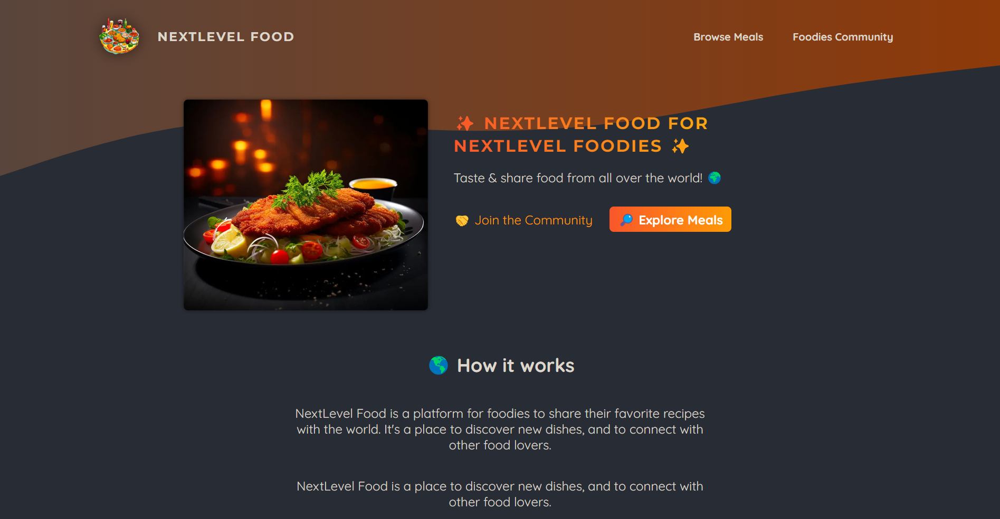
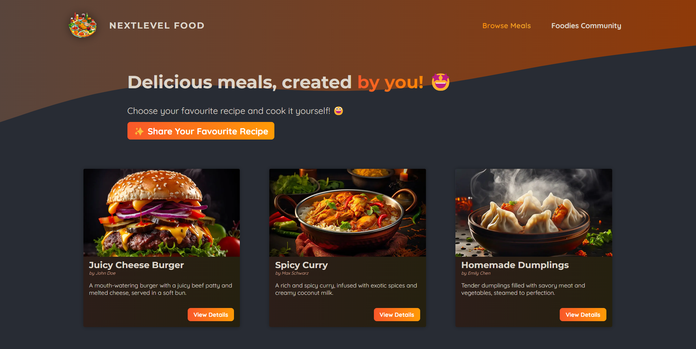
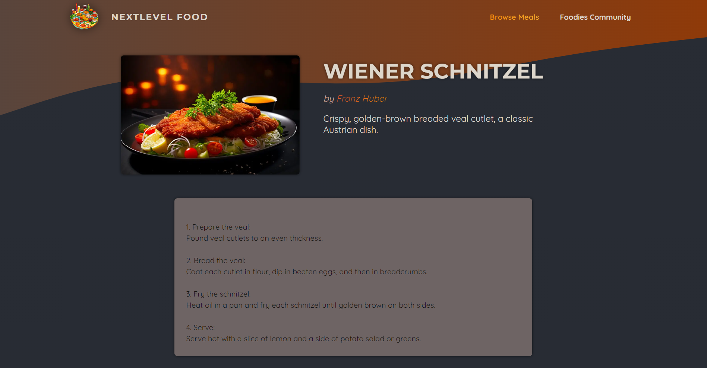
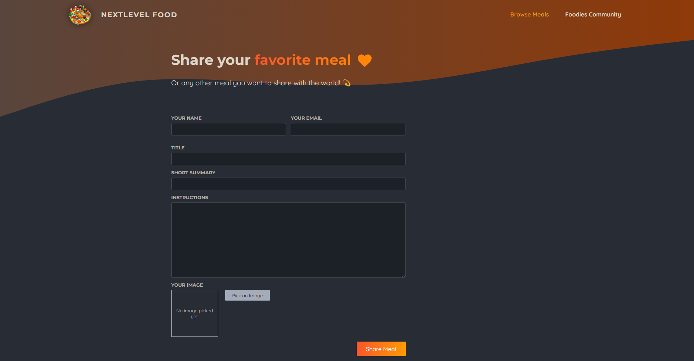

# 🥘 NextLevel Food

## ✨ Purpose

Building this app was a great hands-on way to expand my learning beyond my comfort level with `create-react-app`, which is no longer recommended for new projects by [React's official documentation and best practices](https://react.dev/learn/start-a-new-react-project).

I was curious to learn what Next.js offers as a full-stack React framework, and opted to explore the [App Router](https://nextjs.org/docs/app) method, which is currently the recommended approach for new applications.

## 🙌 Acknowledgements & Thanks

🏫 This app is my take on the **Next.js 14 & React - The Complete Guide** course by Maximilian Schwarzmüller on [Academind](https://academind.com/).

🖼️ The lovely photo of Borscht used in the demo video is by [Nadin Sh](https://www.pexels.com/photo/ready-to-eat-borsch-in-a-pan-18743159/) on [Pexels](https://www.pexels.com/). 

## 🎨 Modifications 

* Slight style & phrasing enhancements (Food puns in the error messages! 🤪 Loads of emojis! 😎)
* Added simple method to prevent database collisions on slugs & filenames (a more sophisticated approach should be used for a production app!)

## 🤩 Final Product

**Homepage View**

**All Meals View**

**Meal Details View**

**Share Meal Form View**

## 👩‍🍳 Usage

Full Stack food community app, featuring:
* **Image Carousel** on main page, rotating through multiple appealing food photos
* Customised **Community Page**, where events or a newsletter signup form could be added
* **Explore Meals** page, displaying a wide selection of user-added recipes to explore
* Dynamic **Meal Details** view, offering users a closer look at the meal photo and complete recipe details
* **Add Meal** Page, with image preview functionality, inviting users to contribute by sharing their own favourite recipe and meal photo

## 👩‍💻 Installation

### Getting Started
* Fork this repository to your own GitHub account
* Clone your fork onto your local device
* Install all dependencies using the `npm i` (or `npm install`) command

### Initialize the Database
* Run `node initdb.js` to populate the DB

#### Resetting the Database
* If you wish to reset the DB, delete the `meals.db` file in the project root, and run the `node initdb.js` command to re-init the DB

### Start the Development Server
* Run `npm run dev`

### Linting
* To check your code for potential errors, stylistic issues, or other problems, run `npm run lint`

### Build the Production-Ready Application
* Run `npm run build`

### Start the Production Server
* Run `npm run start`
